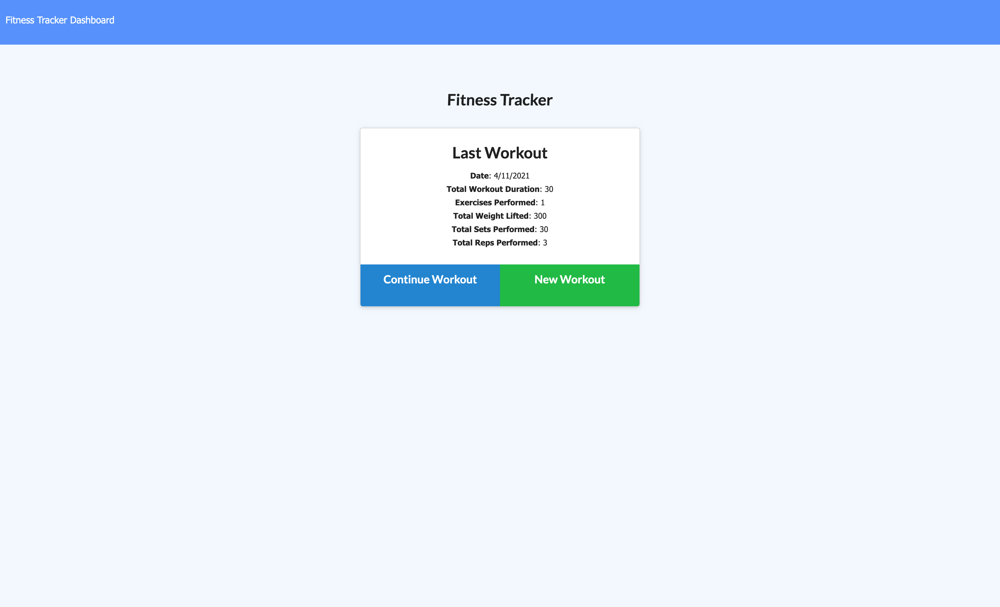
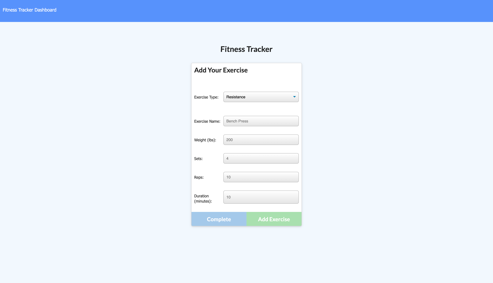
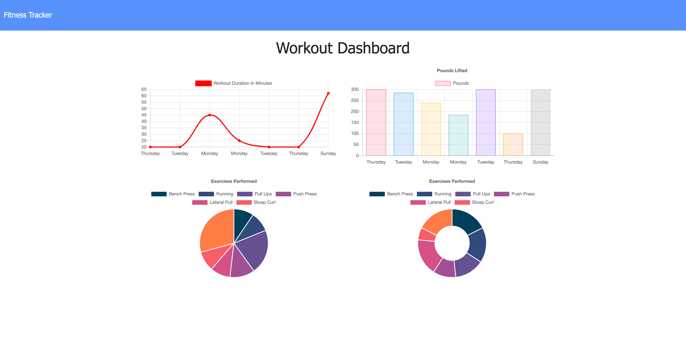

# Workout Tracker

## Table of Contents: 
- [Description](#description)
- [Installation](#installation)
- [User Story](#user-story)
- [Contributing](#contributing)
- [Tests](#tests)
- [License](#license)
- [Questions](#questions)
<hr>

## Description: 
Keeping track of workouts and specific exercises can be a chore. With this Workout Tracker application, the user is given the ability to create a new workout where they are prompted to choose either resistance or cardio based. They can then add data applicable to that type of exercise and add it to the workout. As many exercises can be added to a workout as the user wants. Past workout data can be found in a variety of charts on the Dashboard page. This application uses a MongoDB database to store data with an express server for serving routes. 

<p>Deployed Project: <a href="https://fitness-tracker-kcd.herokuapp.com/">https://fitness-tracker-kcd.herokuapp.com/</a></p>
<p>Find the source code at <a href="https://github.com/koltondecker/workout-tracker">https://github.com/koltondecker/workout-tracker</a>.</p>

<p><a href="https://www.npmjs.com/package/express">Express</a> was used for this project.</p>
<p><a href="https://www.npmjs.com/package/mongoose">Mongoose</a> was used for this project.</p>
<p><a href="https://www.npmjs.com/package/morgan">Morgan</a> was used for this project.</p>

<hr>

### Landing Page
<br>

<hr>

### Adding an Exercise
<br>

<hr>

### Dashboard
<br>

<hr>


## Installation: 
Upon downloading the files from this repo, use 'npm init' to initialize npm package and 'npm i' to install necessary dependencies for this project.
<hr>

## User Story

```
As a fitness fanatic
I want to be able to create workouts, add exercises, and view workout statistics
So that I can keep track of my fitness
```


## Acceptance Criteria

```
GIVEN a workout tracking application
WHEN I open the application
THEN I am presented with a blank screen upon first load with the option to create a new workout
WHEN I click to create a new workout
THEN I am presented with options to choose either resistance or cardio
WHEN I choose an option
THEN I am prompted to input applicable information to track that exercise
WHEN I click complete exercise
THEN I am returned to the home page where data about my workout is displayed
WHEN I click on Dashboard
THEN I am presented with various charts displaying statistics from my past 7 workouts
WHEN I load the homepage
THEN I am presented with my latest workout and options to continue adding exercise data to it
```
<hr>

## Contributing: 
Feel free to contribute to this project in whatever ways you see beneficial. I will review pull requests and update with appropriate additions.
<hr>

## Tests: 
No tests were used for this project.
<hr>

### License: 
No license was used for this project. 
<hr>

### Questions: 
<p>If you would like to learn more, please take a look through my github below:</p>
<p><a href="https://github.com/koltondecker"> </a>Visit my GitHub at <a href="https://github.com/koltondecker">github.com/koltondecker</a></p>
<p>If you still have questions, please send me an email and I will respond as soon as I can:</p>
<p><a href="mailto:deckerman25@gmail.com">deckerman25@gmail.com</a></p>